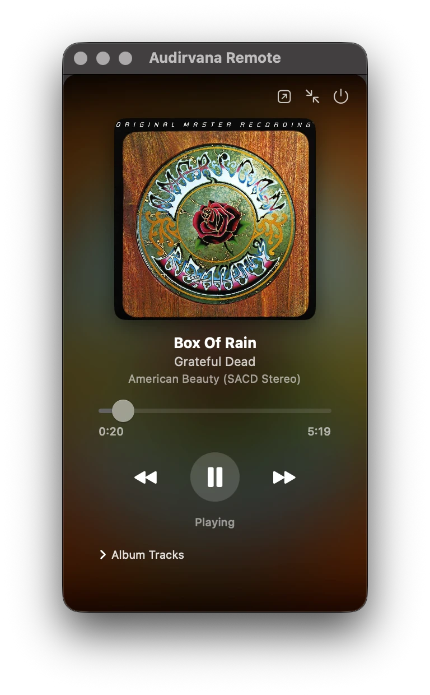
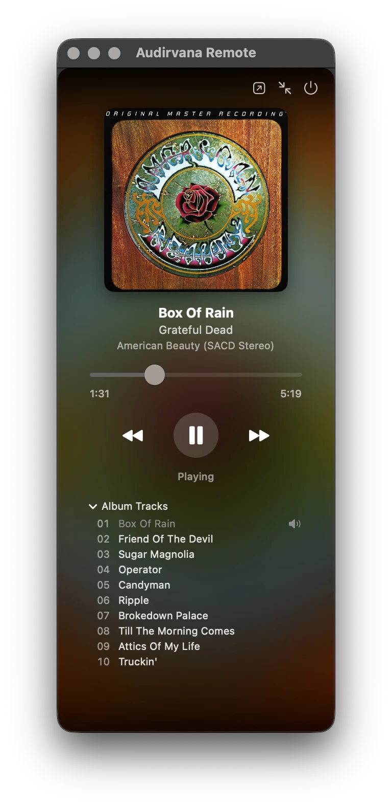

# AudirvanaRemote

A lightweight macOS menu bar remote control for [Audirvana Origin](https://audirvana.com). Control playback, see what's playing, and browse the current album's tracks without bringing Audirvana's own window to the front.

Built with Swift and AppKit/SwiftUI, driving Audirvana via AppleScript/AppleEvents.

<p align="center">
  
  
</p>

## Features

- **Menu bar popover** — now-playing artwork, title, artist, album, and derived audio quality (bit depth / sample rate / codec), with transport controls (play/pause, previous/next), a seek bar, and a volume slider.
- **Detachable floating window** — pop the remote out into its own always-on-top window, independent of the menu bar popover.
- **Album track list** — expand to see every track in the current album's folder and jump directly to one. (Audirvana's own AppleScript dictionary doesn't expose the album track list, so this is derived by reading sibling audio files in the currently playing track's folder.)
- **Starts and stops with Audirvana** — the menu bar icon only appears while Audirvana Origin is actually running, and disappears when it quits. AudirvanaRemote itself stays resident in the background (registered as a login item) so it's ready the instant Audirvana launches — it isn't relaunched each time.
- **Quick access to Audirvana itself** — a toolbar button unhides and activates Audirvana Origin's own window when you need the full library view.

## Requirements

- macOS 14 (Sonoma) or later
- [Audirvana Origin](https://audirvana.com) installed
- Xcode or the Swift toolchain (to build — this is not a signed/notarized release, so it's run from source)

## Installation

1. Clone the repo:
   ```bash
   git clone https://github.com/cjstone707/audirvana-remote.git
   cd audirvana-remote
   ```
2. Build and launch:
   ```bash
   ./build_and_run.sh
   ```
   This runs `swift build`, copies the built binary into `AudirvanaRemote.app`, and launches it. Re-run this script any time you want to rebuild after pulling changes.
3. On first launch, macOS will ask for permission to control Audirvana Origin via Automation (AppleEvents) — allow it; this is how the remote sends playback commands and reads now-playing info.
4. AudirvanaRemote registers itself as a login item on first launch, so it starts automatically at login from then on and doesn't need to be relaunched manually.

There's no Dock icon or app menu — AudirvanaRemote runs purely as a menu bar accessory (`LSUIElement`).

## Usage

- **Speaker icon in the menu bar** — appears only while Audirvana Origin is running. Click it to open/close the remote popover.
- **Toolbar buttons** in the remote (top-right of the popover/window):
  - Detach — opens the remote as a separate floating window
  - Show Audirvana — brings Audirvana Origin's own window forward
  - Minify — collapses to a compact view (title/artist/transport only)
  - Quit — quits Audirvana Origin
- **Album Tracks** — expand the disclosure at the bottom of the full view to see and jump to any track in the current album.

## Uninstalling

```bash
pkill -x AudirvanaRemote
```

Then, to remove it from login items, open **System Settings → General → Login Items**, find AudirvanaRemote under "Allow in the Background," and remove it — or run:
```bash
osascript -e 'tell application "System Events" to delete login item "AudirvanaRemote"' 2>/dev/null
```
(AudirvanaRemote registers itself via `SMAppService`, which is managed through System Settings rather than a traditional login-items list on newer macOS versions — if the command above doesn't find it, remove it from System Settings directly.)

## How it talks to Audirvana

AudirvanaRemote sends AppleEvents to Audirvana Origin's AppleScript dictionary (`Audirvana.sdef`) for transport control and now-playing state, and polls once per second. A couple of things Audirvana's dictionary doesn't expose — audio quality and the album's track list — are derived directly from the currently playing file and its sibling files on disk.

## License

MIT — see [LICENSE](LICENSE).
